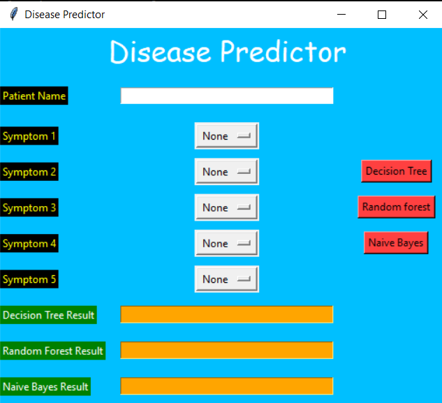

# Disease-Predictor-Project
An ML project which predicts the disease based on the symptoms given by the user via the GUI, using Decision Trees, Random Forest and Naive Bayes algorithms. 
GUI (Tkinter) : 

